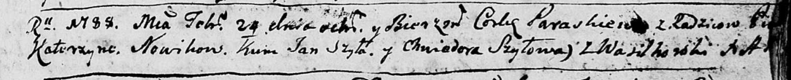
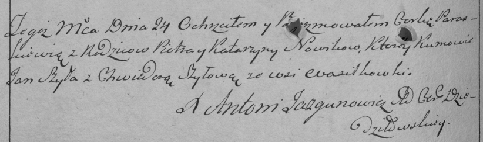

**Новик Параскева Петрова (Nowikowna Paraskiewa)**

24 февраля 1788 г -- крещение дочери Параскевы (НИАБ 136-13-894, лист 4,
№24/1788-р (ориг)), (РГИА 823-2-18, лист 235об, №8/1788-р (коп)).

**НИАБ 136-13-894:** Лист 4. **Метрическая запись №24/1788-р (ориг).**

Дедиловичская Покровская церковь. 24 февраля 1788 года. Метрическая
запись о крещении.

Nowikowna Paraskiewa -- дочь родителей с деревни Васильковка.

Nowik Piotr -- отец.

Nowikowa Katerzyna -- мать.

Szyło Jan - кум.

Szyłowa Chwiedora - кума.

Jazgunowicz Antoniusz -- ксёндз.

**РГИА 823-2-18:** Лист 235об. **Метрическая запись №8/1788-р (коп).**

Дедиловичская Покровская церковь. 24 февраля 1788 года. Метрическая
запись о крещении.

Nowikowna Paraskiewia -- дочь родителей с деревни Васильковка.

Nowik Piotr -- отец.

Nowikowa Katarzyna -- мать.

Szyło Jan -- кум.

Szyłowa Chwiedora - кума.

Jazgunowicz Antoni -- ксёндз.
