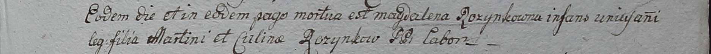

**Розынко Марцин (Rozynko Marcin, Martin)**

29 января 1797 г -- свидетель венчания Василя Шило с деревни Васильковка
и девки Петрунели Розынко с деревни Васильковка (НИАБ 136-13-920, лист
4, №4/1797-б (ориг)).

12 января 1799 г -- отпевание дочери Магдалены (НИАБ 1781-27-199, лист
127, №3/1799-у).

**НИАБ 136-13-920:** Лист 4. **Метрическая запись №4/1797-б (ориг).**

Дедиловичская Покровская церковь. 29 января 1797 года. Метрическая
запись о венчании.

Szyło Wasil -- жених, с деревни Васильковка.

Rozynkowa Petrunela -- невеста, девка, с деревни Васильковка.

Karżewicz Bałtromiey -- свидетель, с деревни Васильковка.

Rozynko Marcin -- свидетель, с деревни Васильковка.

Jazgunowicz Antoni -- ксёндз.

**НИАБ 1781-27-199:** Лист 127. **Метрическая запись №3/1799-у.**

Дедиловичский костел Наисвятейшего Сердца Иисуса. 12 января 1799 года.
Метрическая запись об отпевании.

Rozynkowna Magdalena -- умершая, 1 год, дочь Martini et Culinae Rozynkow
с деревни Васильковка.

Linhart Hyacinthus -- ксёндз.
