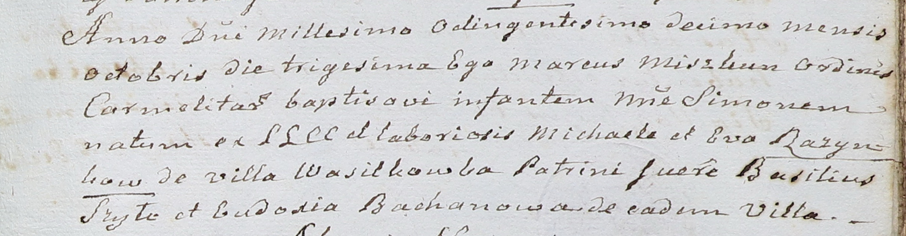

**Розынко Михал (Rozynko Michael)**

30 октября 1810 г -- крещение сына Сымона (НИАБ 937-4-32, лист 22,
№16/1810-р).

**НИАБ 937-4-32:** Лист 22. **Метрическая запись №16/1810-р.**

Дедиловичский костел Наисвятейшего Сердца Иисуса. 30 октября 1810 года.
Метрическая запись о крещении.

Rozynko Simon -- сын крестьян с деревни Васильковка.

Rozynko Michael -- отец.

Rozynkowa Eva -- мать.

SzyBasili -- крестный отец.

Bachanowiczowa Eudoxia -- крестная мать, с деревни Васильковка.

Miszkun Marcus -- ксёндз, с ордена кармелиток.
