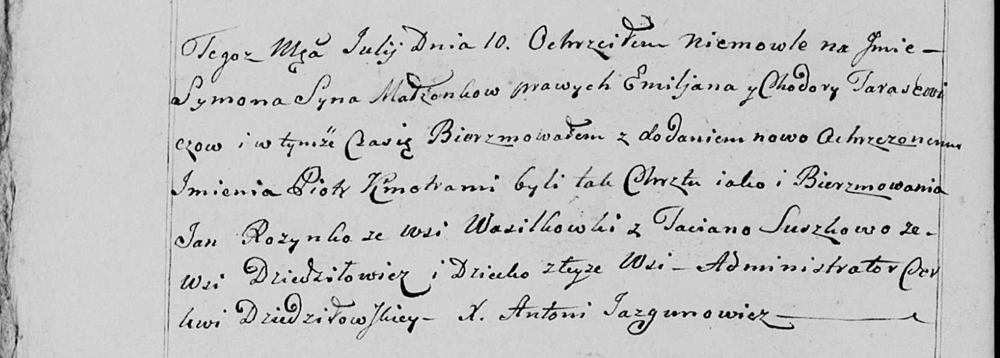

**Розынко Ян (Rozynko Jan)**

10 июля 1800 г -- крестный отец Сымона Петра, сына Тарасевичей Емельяна
и Ходоры с деревни Дедиловичи (НИАБ 136-13-949, лист 102об, №18/1800-р
(коп)).

**НИАБ 136-13-949:** Лист 102об. **Метрическая запись №18/1800-р
(коп).**

(См. тж.: РГИА 823-2-18, лист 276, №16/1800-р (коп), НИАБ 136-13-894,
лист 41об, №17/1800-р (ориг))

Дедиловичская Покровская церковь. 10 июля 1800 года. Метрическая запись
о крещении.

Tarasewicz Symon Piotr -- сын родителей с деревни Дедиловичи.

Tarasewicz Emiljan -- отец.

Tarasewiczowa Chodora -- мать.

Rozynko Jan -- кум, с деревни Васильковка.

Suszkowa Taciana - кума, с деревни Дедиловичи.

Jazgunowicz Antoni -- ксёндз.
