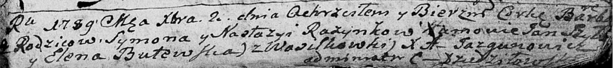

**Розынко Варвара Сымонова (Rozynkowna Barbara)**

2 декабря 1789 г -- крещение (НИАБ 136-13-894, лист 8, №63/1789-р
(ориг)).

**НИАБ 136-13-894:** Лист 8. **Метрическая запись №63/1789-р (ориг).**

Дедиловичская Покровская церковь. 2 декабря 1789 года. Метрическая
запись о крещении.

Rozynkowna Barbara -- дочь родителей с деревни Васильковка.

Rozynko Symon -- отец.

Rozynkowa Nastazya -- мать.

Szyło Jan - кум.

Butewska Elena - кума.

Jazgunowicz Antoni -- ксёндз.
