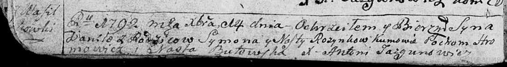
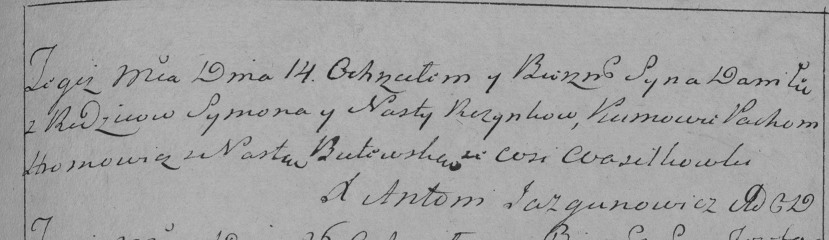

**Розынко Данила Сымонов (Rozynko Daniła)**

14 декабря 1792 г -- крещение (НИАБ 136-13-894, лист 17об, №84/1792-р
(ориг)), (РГИА 823-2-18, лист 246, №38/1792-р (коп)).

**НИАБ 136-13-894:** Лист 17-об. **Метрическая запись №84/1792-р
(ориг).**

Дедиловичская Покровская церковь. 14 декабря 1792 года. Метрическая
запись о крещении.

Rozynko Daniła -- сын родителей с деревни Васильковка.

Rozynko Symon -- отец.

Rozynkowa Nasta -- мать.

Hromowicz Pochom - кум.

Butowska Nasta - кума.

Jazgunowicz Antoni -- ксёндз.

**РГИА 823-2-18:** Лист 246. **Метрическая запись №38/1792-р (коп).**

Дедиловичская Покровская церковь. 14 декабря 1792 года. Метрическая
запись о крещении.

Rozynko Daniła -- сын родителей с деревни Васильковка.

Rozynko Symon -- отец.

Rozynkowa Nasta -- мать.

Hromowicz Pochom -- кум.

Butewska Nasta -- кума.

Jazgunowicz Antoni -- ксёндз.
