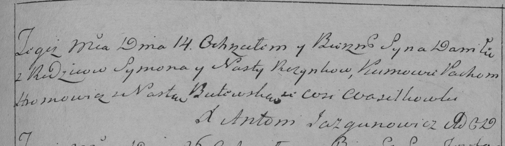

**Розынко Игнацы Сымонов (Rozynko Jgnacy)**

10 декабря 1786 г -- крещение (РГИА 823-2-18, лист 232об, №29/1786-р
(коп)).

**РГИА 823-2-18:** Лист 232об. **Метрическая запись №29/1786-р (коп).**

{width="6.496527777777778in"
height="1.5152777777777777in"}

Дедиловичская Покровская церковь. 10 декабря 1786 года. Метрическая
запись о крещении.

Rozynko Jgnacy -- сын родителей с деревни Васильковка.

Rozynko Symon -- отец.

Rozynkowa Nastazya -- мать.

Szyła Jan -- кум.

Butewska Rozalia - кума.

Jazgunowicz Antoni -- ксёндз.
