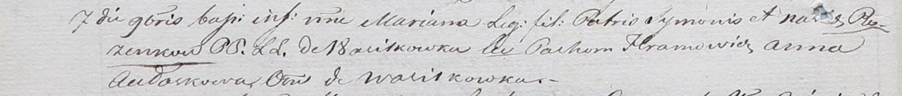

**Розынко Марьяна Сымонова (Rozinkowna Mariana)**

7 ноября 1801 г -- крещение (НИАБ 937-4-32, лист 4об, №23/1801-р).

**НИАБ 937-4-32:** Лист 4об. **Метрическая запись №23/1801-р.**

{width="6.496527777777778in"
height="0.6958333333333333in"}

Дедиловичский костел Наисвятейшего Сердца Иисуса. 7 ноября 1801 года.
Метрическая запись о крещении.

Rozinkowna Mariana -- дочь родителей с деревни Васильковка.

Rozinko Symon -- отец.

Rozinkowa Nasta -- мать.

Hramowicz Pachom -- крестный отец, с деревни Васильковка.

Aułaskowa Anna -- крестная мать, с деревни Васильковка.

Linhart Hyacinthus -- ксёндз.
