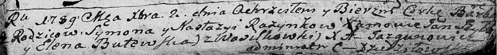
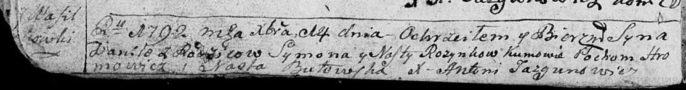
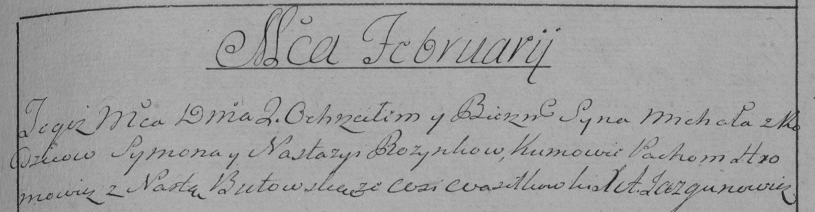
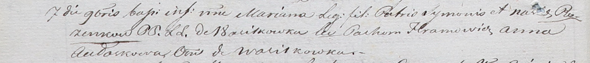

**Розынко Настасья (Rozynkowa Nastazya, Nasta)**

10 декабря 1786 г -- крещение сына Игнацыя (РГИА 823-2-18, лист 232об,
№29/1786-р (коп)).

2 декабря 1789 г -- крещение дочери Варвары (НИАБ 136-13-894, лист 8,
№63/1789-р (ориг)).

14 декабря 1792 г -- крещение сына Данилы (НИАБ 136-13-894, лист 17об,
№84/1792-р (ориг)), (РГИА 823-2-18, лист 246, №38/1792-р (коп)).

2 февраля 1796 г -- крещение сына Павла Бенедыкта (НИАБ 136-13-894, лист
27об, №14/1795-р (ориг)), (РГИА 823-2-18, лист 255, №6/1796-р (коп)).

7 ноября 1801 г -- крещение дочери Марьяны (НИАБ 937-4-32, лист 4об,
№23/1801-р).

**РГИА 823-2-18:** Лист 232об. **Метрическая запись №29/1786-р (коп).**

Дедиловичская Покровская церковь. 10 декабря 1786 года. Метрическая
запись о крещении.

Rozynko Jgnacy -- сын родителей с деревни Васильковка.

Rozynko Symon -- отец.

Rozynkowa Nastazya -- мать.

Szyła Jan -- кум.

Butewska Rozalia - кума.

Jazgunowicz Antoni -- ксёндз.

**НИАБ 136-13-894:** Лист 8. **Метрическая запись №63/1789-р (ориг).**

Дедиловичская Покровская церковь. 2 декабря 1789 года. Метрическая
запись о крещении.

Rozynkowna Barbara -- дочь родителей с деревни Васильковка.

Rozynko Symon -- отец.

Rozynkowa Nastazya -- мать.

Szyło Jan - кум.

Butewska Elena - кума.

Jazgunowicz Antoni -- ксёндз.

**НИАБ 136-13-894:** Лист 17-об. **Метрическая запись №84/1792-р
(ориг).**

Дедиловичская Покровская церковь. 14 декабря 1792 года. Метрическая
запись о крещении.

Rozynko Daniła -- сын родителей с деревни Васильковка.

Rozynko Symon -- отец.

Rozynkowa Nasta -- мать.

Hromowicz Pochom - кум.

Butowska Nasta - кума.

Jazgunowicz Antoni -- ксёндз.

**РГИА 823-2-18:** Лист 246. **Метрическая запись №38/1792-р (коп).**

Дедиловичская Покровская церковь. 14 декабря 1792 года. Метрическая
запись о крещении.

Rozynko Daniła -- сын родителей с деревни Васильковка.

Rozynko Symon -- отец.

Rozynkowa Nasta -- мать.

Hromowicz Pochom -- кум.

Butewska Nasta -- кума.

Jazgunowicz Antoni -- ксёндз.

**НИАБ 136-13-894:** Лист 27об. **Метрическая запись №14/1796-р
(ориг).**

Дедиловичская Покровская церковь. 2 февраля 1796 года. Метрическая
запись о крещении.

Rozynko Paweł Benedykt -- сын родителей с деревни Васильковка.

Rozynko Symon -- отец.

Rozynkowa Nastazyia -- мать.

Slizień Benedykt, WJP -- кум, шляхтич.

Jazgunowiczowna Wiktorya - кума.

Hromowicz Pochom -- ассистент.

Butowska Nasta -- ассистент.

Jazgunowicz Antoni -- ксёндз.

**РГИА 823-2-18:** Лист 255. **Метрическая запись №6/1796-р (коп).**

Дедиловичская Покровская церковь. 2 февраля 1796 года. Метрическая
запись о крещении.

Rozynko Michał \[Paweł Benedykt\] -- сын родителей с деревни
Васильковка.

Rozynko Symon -- отец.

Rozynkowa Nastazya -- мать.

Hromowicz Pachom -- кум.

Butowska Nasta -- кума.

Jazgunowicz Antoni -- ксёндз.

**НИАБ 937-4-32:** Лист 4об. **Метрическая запись №23/1801-р.**

Дедиловичский костел Наисвятейшего Сердца Иисуса. 7 ноября 1801 года.
Метрическая запись о крещении.

Rozinkowna Mariana -- дочь родителей с деревни Васильковка.

Rozinko Symon -- отец.

Rozinkowa Nasta -- мать.

Hramowicz Pachom -- крестный отец, с деревни Васильковка.

Aułaskowa Anna -- крестная мать, с деревни Васильковка.

Linhart Hyacinthus -- ксёндз.
