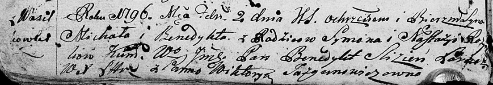
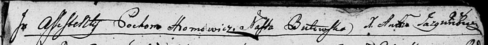
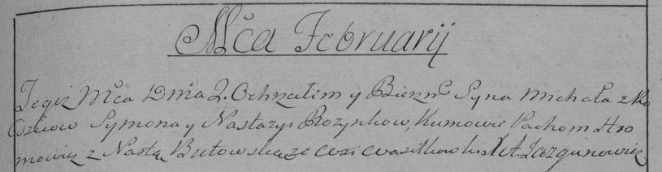

**Розынко Павел Сымонов (Rozynko Paweł Benedykt)**

2 февраля 1796 г -- крещение сына Павла Бенедыкта (НИАБ 136-13-894, лист
27об, №14/1795-р (ориг)), (РГИА 823-2-18, лист 255, №6/1796-р (коп)).

**НИАБ 136-13-894:** Лист 27об. **Метрическая запись №14/1796-р
(ориг).**

Дедиловичская Покровская церковь. 2 февраля 1796 года. Метрическая
запись о крещении.

Rozynko Paweł Benedykt -- сын родителей с деревни Васильковка.

Rozynko Symon -- отец.

Rozynkowa Nastazyia -- мать.

Slizień Benedykt, WJP -- кум, шляхтич.

Jazgunowiczowna Wiktorya - кума.

Hromowicz Pochom -- ассистент.

Butowska Nasta -- ассистент.

Jazgunowicz Antoni -- ксёндз.

**РГИА 823-2-18:** Лист 255. **Метрическая запись №6/1796-р (коп).**

Дедиловичская Покровская церковь. 2 февраля 1796 года. Метрическая
запись о крещении.

Rozynko Michał \[Paweł Benedykt\] -- сын родителей с деревни
Васильковка.

Rozynko Symon -- отец.

Rozynkowa Nastazya -- мать.

Hromowicz Pachom -- кум.

Butowska Nasta -- кума.

Jazgunowicz Antoni -- ксёндз.
