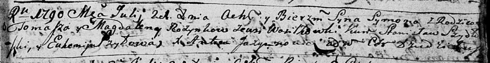

**Розынко Сымон Хомов (Rozynko Symon)**

21 июля 1790 г -- крещение (НИАБ 136-13-894, лист 10, №44/1790-р
(ориг)).

**НИАБ 136-13-894:** Лист 10. **Метрическая запись №44/1790-р (ориг).**

Дедиловичская Покровская церковь. 21 июля 1790 года. Метрическая запись
о крещении.

Rozynko Symon -- сын родителей с деревни Васильковка.

Rozynko Tomasz -- отец.

Rozynkowa Magdalena -- мать.

Szydłowski Stanisław - кум.

Szyłowa Euhenija - кума.

Jazgunowicz Antoni -- ксёндз.
