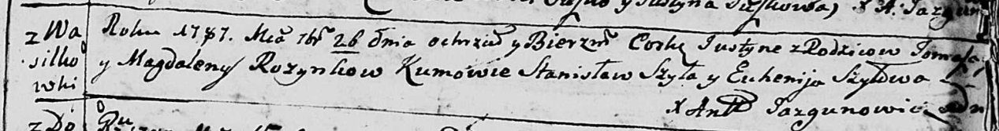

**Розынко Юстына Хомова (Rozynkowna Justyna)**

26 сентября 1787 г -- крещение (НИАБ 136-13-894, лист 2, №51/1787-р
(ориг)).

**НИАБ 136-13-894:** Лист 3. **Метрическая запись №51/1787-р (ориг).**

{width="6.496527777777778in"
height="0.8562357830271216in"}

Дедиловичская Покровская церковь. 26 сентября 1787 года. Метрическая
запись о крещении.

Rozynkowna Justyna -- дочь родителей с деревни Васильковка.

Rozynko Tomasz -- отец.

Rozynkowa Magdalena -- мать.

Szyło Stanislaw - кум.

Szyłowa Euhenija - кума.

Jazgunowicz Antoni -- ксёндз.
