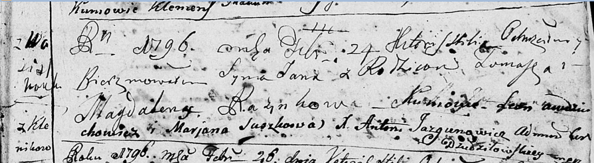
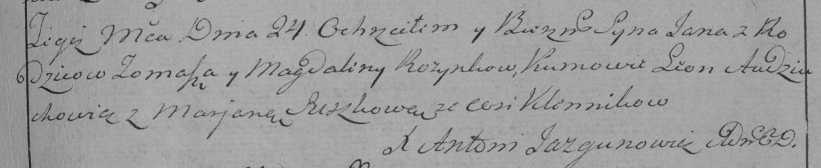

**Розынко Ян Хомов (Rozynko Jan)**

24 февраля 1796 г -- крещение (НИАБ 136-13-894, лист 28, №23/1796-р
(ориг)), (РГИА 823-2-18, лист 255, №9/1796-р (коп)).

Лист 28. **Метрическая запись №23/1796-р (ориг).**

Дедиловичская Покровская церковь. 24 февраля 1796 года. Метрическая
запись о крещении.

Rozynka Jan -- сын родителей с деревни Васильковка.

Rozynka Tomasz -- отец.

Rozynkowa Magdalena -- мать.

Audziuchowicz Leon - кум.

Suszkowa Marjana - кума.

Jazgunowicz Antoni -- ксёндз.

**РГИА 823-2-18:** Лист 255. **Метрическая запись №9/1796-р (коп).**

Дедиловичская Покровская церковь. 24 февраля 1796 года. Метрическая
запись о крещении.

Rozynko Jan -- сын родителей с деревни \[Васильковка\] Клииники.

Rozynko Tomasz -- отец.

Rozynkowa Magdalena -- мать.

Audziuchowicz Leon -- кум.

Suszkowa Marjana -- кума.

Jazgunowicz Antoni -- ксёндз.
