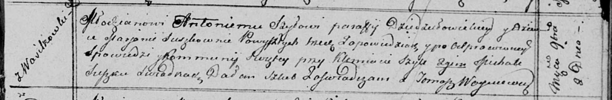

**Шило (в девичестве Сушко) Марьяна (Szyłowa Marjana z Szyłow)**

2 ноября 1813 г -- венчание с молодым Антонием Шило с деревни
Васильковка (НИАБ 136-13-920, лист 20, №16/1813-об (ориг)).

**НИАБ 136-13-920:** Лист 20. **Метрическая запись №16/1813-б (ориг).**

{width="6.496527777777778in"
height="1.0687860892388452in"}

Осовская Покровская церковь. 2 ноября 1813 года. Запись о венчании.

Szyło Antoni -- жених, молодой, парафии Дедиловичской католической, с
деревни Васильковка.

Suszkowna Marjana -- невеста, девка, с деревни Васильковка.

Szyło Klemiatа -- свидетель.

Suszko Michał -- свидетель.

Woyniewicz Tomasz -- ксёндз.
