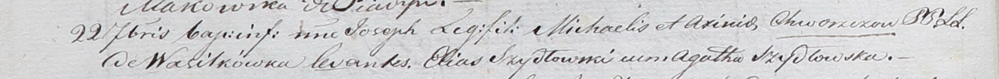

**Хвощ Аксиня (Chwoszczowa Axina)**

18 марта 1800 г -- крещение сына Иоанна (НИАБ 937-4-32, лист 1,
№5/1800-р).

22 сентября 1801 г -- крещение сына Иосифа (НИАБ 937-4-32, лист 4об,
№19/1801-р).

**НИАБ 937-4-32:** Лист 1. **Метрическая запись №5/1800-р.**

Дедиловичский костел Наисвятейшего Сердца Иисуса. 18 марта 1800 года.
Метрическая запись о крещении.

Chwoszcz Joann -- сын крестьян с деревни Васильковка.

Chwoszcz Michael -- отец.

Chwoszczowa Axina -- мать.

Szyło Elias -- крестный отец.

Szyłowa Agatha -- крестная мать, с деревни Васильковка.

Linhart Hyacinthus -- ксёндз.

**НИАБ 937-4-32:** Лист 4об. **Метрическая запись №19/1801-р.**

Дедиловичский костел Наисвятейшего Сердца Иисуса. 22 сентября 1801 года.
Метрическая запись о крещении.

Chwoszcz Joseph -- сын родителей с деревни Васильковка.

Chwoszcz Michael -- отец.

Chwoszczowa Axinia -- мать.

Szydłowski Elias -- крестный отец.

Szydłowska Agatha -- крестная мать.

Linhart Hyacinthus -- ксёндз.
