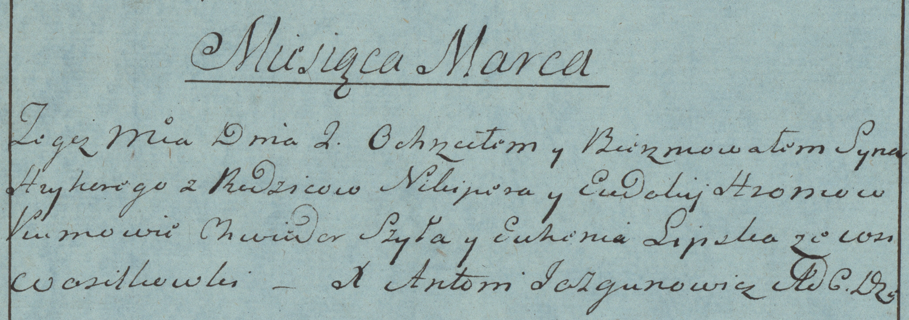

**Хромович Грыгоры Никиперов (Hroniec Hryhory)**

2 марта 1783 г -- крещение (РГИА 823-2-18, лист 223об, №5/1783-р (коп)).

**РГИА 823-2-18:** Лист 223об. **Метрическая запись №5/1783-р (коп).**

{width="6.496527777777778in"
height="2.292361111111111in"}

Дедиловичская Покровская церковь. 2 марта 1783 года. Метрическая запись
о крещении.

Hroniec? Hryhory -- сын родителей с деревни Васильковка.

Hroniec? Nikiper -- отец.

Hroncowa? Eudokija -- мать.

Szyła Chwiedor -- кум.

Lipska Euhenia - кума.

Jazgunowicz Antoni -- ксёндз.
