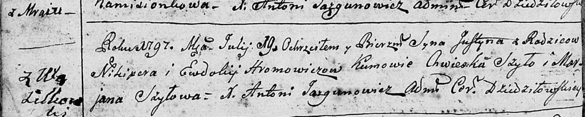

**Хромович Юстын Никиперов (Hromowicz Justyn)**

19 июля 1797 г -- крещение (РГИА 823-2-18, лист 33об, №44/1797-р (коп)),
(РГИА 823-2-18, лист 260, №30/1797-р (коп)).

**НИАБ 136-13-894:** Лист 33об. **Метрическая запись №44/1797-р
(ориг).**

Дедиловичская Покровская церковь. 19 июля 1797 года. Метрическая запись
о крещении.

Hromowicz Justyn -- сын родителей с деревни Васильковка.

Hromowicz Nikiper -- отец.

Hromowiczowa Ewdokija -- мать.

Szyło Chweska - кум.

Szyłowa Marjana - кума.

Jazgunowicz Antoni -- ксёндз.

**РГИА 823-2-18:** Лист 260. **Метрическая запись №30/1797-р (коп).**

Дедиловичская Покровская церковь. 19 июля 1797 года. Метрическая запись
о крещении.

Hromowicz Justyn -- сын родителей с деревни \[Васильковка\]
(см.тж.Озерщизна).

Hromowicz Nikiper -- отец.

Hromowiczowa Eudokija -- мать.

Szyła Chwieszko -- кум.

Szyłowa Marjana -- кума.

Jazgunowicz Antoni -- ксёндз.
