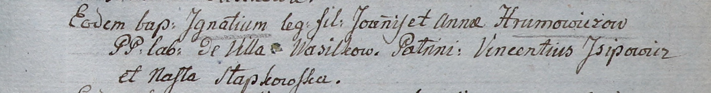

**Хромович Игнатий Янов (Hramowicz Jgnati)**

3 сентября 1805 г -- крещение (НИАБ 937-4-32, лист 12, №34/1805-р).

**НИАБ 937-4-32:** Лист 12. **Метрическая запись №34/1805-р.**

Дедиловичский костел Наисвятейшего Сердца Иисуса. 3 сентября 1805 года.
Метрическая запись о крещении.

Hramowicz Jgnati -- сын крестьян с деревни Васильковка.

Hramowicz Joann -- отец.

Haramowiczowa Anna -- мать.

Jsjpowicz Vincenti -- крестный отец.

Słapkowska Nasta -- крестная мать.

Linhart Hiacinthus -- ксёндз.
