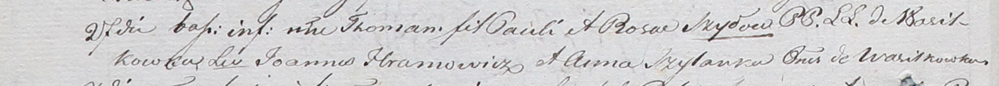

**Хромович Параскевия Янова (Hromowiczowna Paraskiewia)**

6 августа 1813 г -- крещение (НИАБ 136-13-894, лист 87, №23/1813-р
(ориг)).

**НИАБ 136-13-894:** Лист 87. **Метрическая запись №23/1813-р (ориг).**

{width="6.496527777777778in"
height="0.8830555555555556in"}

Осовская Покровская церковь. 6 августа 1813 года. Метрическая запись о
крещении.

Hramowiczowna Paraskiewia -- дочь родителей с деревни Васильковка.

Hramowicz Jan -- отец.

Hramowiczowa Anna -- мать.

Szyło Jakub -- кум.

Szyłowa Nastazija -- кума.

Woyniewicz Tomasz -- ксёндз.
