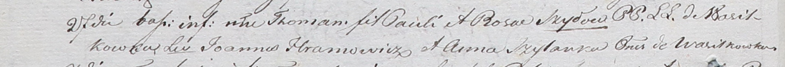

**Хромович Текля Янова (Hromowiczowna Tekla)**

18 августа 1810 г -- крещение (НИАБ 136-13-894, лист 78, №34/1810-р
(ориг)).

**НИАБ 136-13-894:** Лист 78. **Метрическая запись №34/1810-р (ориг).**

{width="6.496527777777778in"
height="0.8683048993875766in"}

Осовская Покровская церковь. 18 августа 1810 года. Метрическая запись о
крещении.

Hramowiczowna Tekla -- дочь родителей с деревни Васильковка.

Hramowicz Jan -- отец.

Hramowiczowa Anna -- мать.

Szyłowski Sylwester -- кум.

Szyłowska Katerzyna -- кума.

Woyniewicz Tomasz -- ксёндз.
