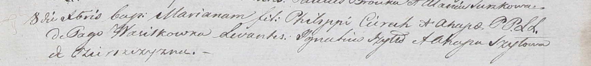

**Церах Марьяна Агапова (Cierachowna Mariana)**

8 декабря 1801 г -- крещение (НИАБ 937-4-32, лист 5, №28/1801-р).

**НИАБ 937-4-32:** Лист 5. **Метрическая запись №28/1801-р.**

{width="6.496527777777778in"
height="0.7340277777777777in"}

Дедиловичский костел Наисвятейшего Сердца Иисуса. 8 декабря 1801 года.
Метрическая запись о крещении.

Cierachowna Mariana -- дочь родителей с деревни Васильковка.

Cierach Philip -- отец.

Cierachowa Ahapa -- мать.

Szyłło Jgnatius -- крестный отец, с деревни Озерщизна.

Szyłowa Ahapa -- крестная мать, с деревни Озерщизна.

Linhart Hyacinthus -- ксёндз.
