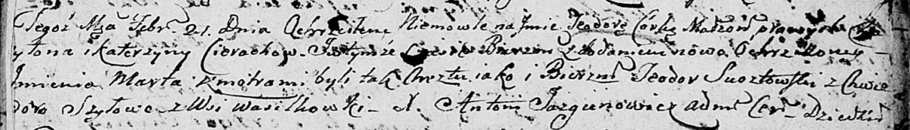

**Церах Харытон? (Cierach Charyton?)**

21 февраля 1804 г -- крещение дочери Теодоры Марты (НИАБ 136-13-894,
лист 53, №7/1804-р (ориг)).

**НИАБ 136-13-894:** Лист 53. **Метрическая запись №7/1804-р (ориг).**

Дедиловичская Покровская церковь. 21 февраля 1804 года. Метрическая
запись о крещении.

Cierachowna Teodora Marta -- дочь родителей с деревни Васильковка.

Cierach Charyton? -- отец.

Cierachowa Katerzyna -- мать.

Susztowski Teodor -- кум.

Szyłowa Chwiedora -- кума.

Jazgunowicz Antoni -- ксёндз.
