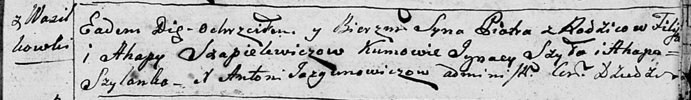
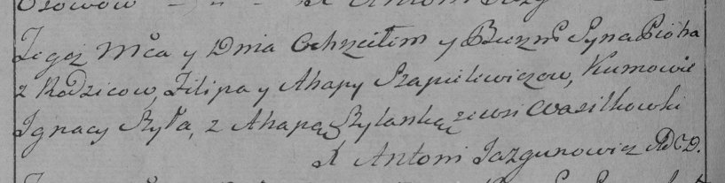

**Шапелевич Агапа (Szapielewiczowa Ahapa)**

18 января 1797 г -- крещение сына Петра (НИАБ 136-13-894, лист 32,
№5/1797-р (ориг)), (РГИА 823-2-18, лист 258об, №5/1797-р (коп)).

**НИАБ 136-13-894:** Лист 32. **Метрическая запись №5/1797-р (ориг).**

Дедиловичская Покровская церковь. 18 января 1797 года. Метрическая
запись о крещении.

Szapielewicz Piotr -- сын родителей с деревни Васильковка.

Szapielewicz Filip -- отец.

Szapielewiczowa Ahapa -- мать.

Szyło Jgnacy - кум.

Szyłanko Ahapa - кума.

Jazgunowicz Antoni -- ксёндз.

**РГИА 823-2-18:** Лист 258об. **Метрическая запись №5/1797-р (коп).**

Дедиловичская Покровская церковь. 18 января 1797 года. Метрическая
запись о крещении.

Szapielewicz Piotr -- сын родителей с деревни Васильковка.

Szapielewicz Filip -- отец.

Szapielewiczowa Ahapa -- мать.

Szyła Jgnacy -- кум.

Szyłanka Ahapa -- кума.

Jazgunowicz Antoni -- ксёндз.
