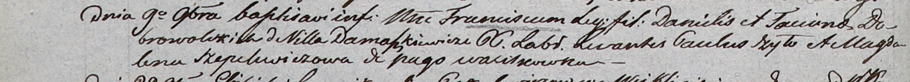

**Шапелевич Магдалена (Szapelewiczowa Magdalena)**

9 ноября 1803 г -- крестная мать Франциска, сына Данилы и Татьяны
Добровольских с деревни Домашковичи (НИАБ 937-4-32, лист 9об,
№28/1803-р).

**НИАБ 937-4-32:** Лист 9об. **Метрическая запись №28/1803-р.**

{width="6.496527777777778in"
height="0.5902777777777778in"}

Дедиловичский костел Наисвятейшего Сердца Иисуса. 9 ноября 1803 года.
Метрическая запись о крещении.

Dobrowolski Francisc -- сын крестьян с деревни Домашковичи.

Dobrowolski Daniel -- отец.

Dobrowolska Taciana -- мать.

Szyło Paul -- крестный отец.

Szapelewiczowa Magdalena -- крестная мать, с деревни Васильковка.

Galinowski Joann -- ксёндз, комендант Дедиловичского костела.
