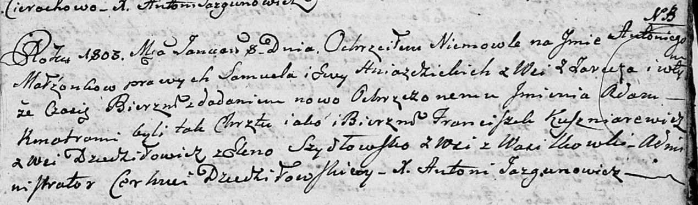

**Шидловская Елена (Szydłowska Elena)**

8 января 1803 г -- крестная мать Антона Адама, сына Гнездицких Самуся и
Евы с деревни Заречье (НИАБ 136-13-894, лист 49, №1/1803-р (ориг)).

**НИАБ 136-13-894:** Лист 49. **Метрическая запись №1/1803-р (ориг).**

Дедиловичская Покровская церковь. 8 января 1803 года. Метрическая запись
о крещении.

Hniazdzicki Antoni Adam -- сын родителей с деревни Заречье.

Hniazdzicki Samuel -- отец.

Hniazdzicka Ewa -- мать.

Kuszniarewicz Franciszek -- кум, с деревни Дедиловичи.

Szydłowska Elena -- кума, с деревни Васильковка.

Jazgunowicz Antoni -- ксёндз.
