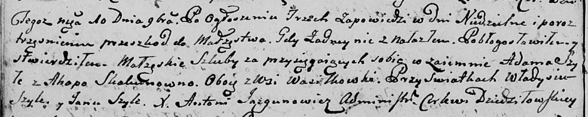
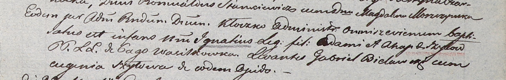
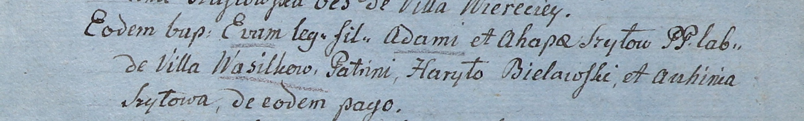
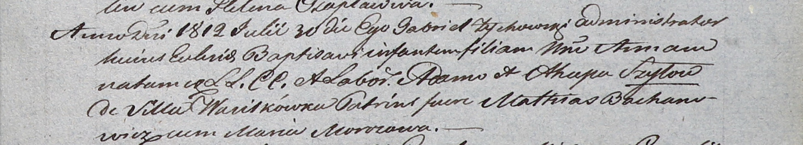

**Шило (Скакун) Агапа (Szyłowa (Skakunowna) Ahapa)**

10 ноября 1801 г -- венчание с Адамом Шило с деревни Васильковка (НИАБ
136-13-920, лист 7об, №7/1801-б (ориг)).

15 марта 1803 г -- крещение сына Игнатия (НИАБ 937-4-32, лист 9,
№8/1803-р).

2 января 1805 г -- крещение дочери Евы (НИАБ 937-4-32, лист 11,
№4/1805-р).

30 июля 1812 г -- крещение дочери Анны (НИАБ 937-4-32, лист 25,
№20/1812-р).

**НИАБ 136-13-894:** Лист 7об. **Метрическая запись №7/1801-б (ориг).**

Дедиловичская Покровская церковь. 10 ноября 1801 года. Метрическая
запись о венчании.

Szyło Adam -- жених, с деревни Васильковка.

Skakunowna Ahapa -- невеста, с деревни Васильковка.

Szyła Władyś -- свидетель.

Szyła Jan -- свидетель.

Jazgunowicz Antoni -- ксёндз.

**НИАБ 937-4-32:** Лист 9. **Метрическая запись №8/1803-р.**

Дедиловичский костел Наисвятейшего Сердца Иисуса. 15 марта 1803 года.
Метрическая запись о крещении.

Szyło Jgnati -- сын родителей с деревни Васильковка.

Szyło Adam -- отец.

Szyłowa Ahapa -- мать.

Bielawski Gabriel -- крестный отец.

Szyłowa Eugenia -- крестная мать, с деревни Васильковка.

Kłoczko Antoni -- ксёндз, администратор церкви Омнишевской.

**НИАБ 937-4-32:** Лист 11. **Метрическая запись №4/1805-р.**

Дедиловичский костел Наисвятейшего Сердца Иисуса. 2 января 1805 года.
Метрическая запись о крещении.

Szyłowna Eva -- дочь крестьян с деревни Васильковка.

Szyło Adam -- отец.

Szyłowa Ahapa -- мать.

Bielawski Haryło -- крестный отец, с деревни Васильковка.

Szyłowa Auchinia -- крестная мать, с деревни Васильковка.

Linhart Hiacinthus -- ксёндз.

**НИАБ 937-4-32:** Лист 25. **Метрическая запись №20/1812-р.**

Дедиловичский костел Наисвятейшего Сердца Иисуса. 30 июля 1812 года.
Метрическая запись о крещении.

Szyłowna Anna -- дочь крестьян с деревни Васильковка.

Szyło Adam -- отец.

Szyłowa Ahapa -- мать.

Bachanowicz Mathias -- крестный отец.

Morozowa Maria -- крестная мать.

Zychowski Gabriel -- ксёндз.
