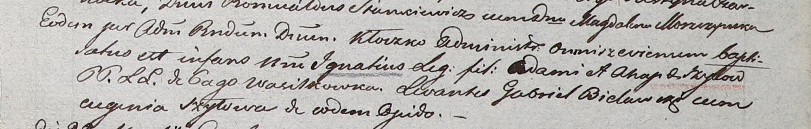

**Шило Игнатий Адамов (Szyło Jgnati)**

15 марта 1803 г -- крещение (НИАБ 937-4-32, лист 9, №8/1803-р).

**НИАБ 937-4-32:** Лист 9. **Метрическая запись №8/1803-р.**

Дедиловичский костел Наисвятейшего Сердца Иисуса. 15 марта 1803 года.
Метрическая запись о крещении.

Szyło Jgnati -- сын родителей с деревни Васильковка.

Szyło Adam -- отец.

Szyłowa Ahapa -- мать.

Bielawski Gabriel -- крестный отец.

Szyłowa Eugenia -- крестная мать, с деревни Васильковка.

Kłoczko Antoni -- ксёндз, администратор церкви Омнишевской.
