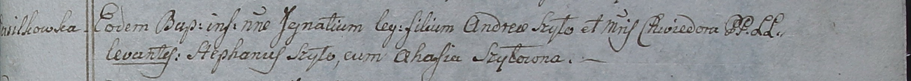

**Шило Игнаты Андреев (Szyło Jhnaty)**

12 октября 1798 г -- крещение (НИАБ 1781-27-199, лист 123, №11/1798-р).

**НИАБ 1781-27-199:** Лист 123. **Метрическая запись №11/1798-р.**

{width="6.496527777777778in"
height="0.5826388888888889in"}

Дедиловичский костел Наисвятейшего Сердца Иисуса. 12 октября 1798 года.
Метрическая запись о крещении.

Szyło Jgnaty -- сын крестьян с деревни Васильковка.

Szyło Andrei -- отец.

Szyłowa Chwiedora -- мать.

Szyło Stefanus -- крестный отец.

Szyłowna Ahafia - крестная мать.

Linhart Hyacinthus -- ксёндз.
