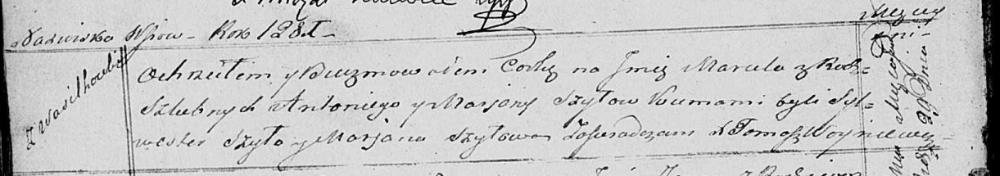

**Шило Марцеля Антониева (Szyłowna Marcela)**

29 января 1821 г -- крещение (НИАБ 136-13-894, лист 105об, №1/1821-р
(ориг)).

**НИАБ 136-13-894:** Лист 105об. **Метрическая запись №1/1821-р
(ориг).**

{width="6.496527777777778in"
height="1.1438823272090988in"}

Осовская Покровская церковь. 29 января 1821 года. Метрическая запись о
крещении.

Szyłowna Marсela -- дочь родителей с деревни Васильковка.

Szyło Antoni -- отец.

Szyłowa Marjana -- мать.

Szyło Sylwester -- кум.

Szłowa Marjana -- кума.

Woyniewicz Tomasz -- ксёндз.
