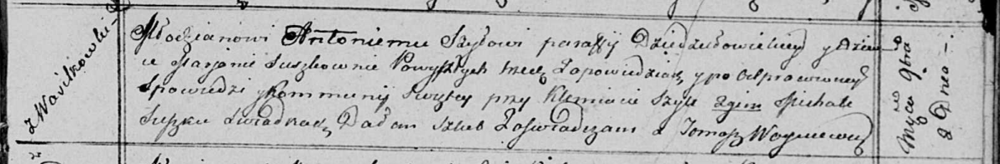
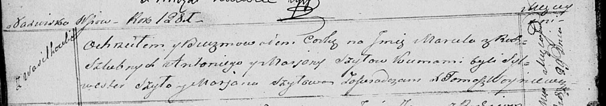

**Шило (в девичестве Сушко) Марьяна (Szyłowa Marjana z Szyłow)**

2 ноября 1813 г -- венчание с молодым Антонием Шило с деревни
Васильковка (НИАБ 136-13-920, лист 20, №16/1813-об (ориг)).

29 января 1821 г -- крещение дочери Марцели (НИАБ 136-13-894, лист
105об, №1/1821-р (ориг)).

**НИАБ 136-13-920:** Лист 20. **Метрическая запись №16/1813-б (ориг).**

Осовская Покровская церковь. 2 ноября 1813 года. Запись о венчании.

Szyło Antoni -- жених, молодой, парафии Дедиловичской католической, с
деревни Васильковка.

Suszkowna Marjana -- невеста, девка, с деревни Васильковка.

Szyło Klemiatа -- свидетель.

Suszko Michał -- свидетель.

Woyniewicz Tomasz -- ксёндз.

**НИАБ 136-13-894:** Лист 105об. **Метрическая запись №1/1821-р
(ориг).**

Осовская Покровская церковь. 29 января 1821 года. Метрическая запись о
крещении.

Szyłowna Marсela -- дочь родителей с деревни Васильковка.

Szyło Antoni -- отец.

Szyłowa Marjana -- мать.

Szyło Sylwester -- кум.

Szłowa Marjana -- кума.

Woyniewicz Tomasz -- ксёндз.
