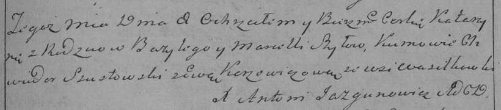

**Шило Базыль (Szyło Bazyli, Baseli)**

14 февраля (7 марта?)1792 г -- крещение дочери Катерины (РГИА 823-2-18,
лист 244, №5/1792-р (коп), НИАБ 136-13-894, лист 15, №8 и 11/1792-р
(ориг))

6 сентября 1795 г -- крещение сына Якуба (НИАБ 136-13-894, лист 25,
№35/1795-р (ориг)), (РГИА 823-2-18, лист 253, №28/1795-р (коп)).

5 января 1799 г -- крещение дочери Марьяны (НИАБ 1781-27-199, лист 125,
№3/1799-р).

25 августа 1801 г -- крещение сына Бартоломея (НИАБ 937-4-32, лист 4об,
№17/1801-р).

**НИАБ 136-13-894:** Лист 15. **Метрическая запись №8/1792-р (ориг).**

{width="6.496527777777778in"
height="1.0258737970253717in"}

Дедиловичская Покровская церковь. 14 февраля 1792 года. Метрическая
запись о крещении.

Szyłowna Katerzyna -- дочь родителей с деревни Васильковка.

Szyło Bazyli -- отец.

Szyłowa Marcella -- мать.

Szutowski Chwiedor -- кум.

Karżewiczowa Ewa - кума.

Jazgunowicz Antoni -- ксёндз.

**НИАБ 136-13-894:** Лист 15. **Метрическая запись №11/1792-р (ориг).**

{width="6.496527777777778in"
height="0.5236646981627296in"}

Дедиловичская Покровская церковь. 7 марта 1792 года. Метрическая запись
о крещении.

Szyłowna Katerzyna -- дочь родителей с деревни Васильковка.

Szyło \[Bazyli\] -- отец.

Szyło Marcella -- мать.

Szu\[s\]towski Chwiedor -- кум.

Karżewiczowa Ewa - кума.

Jazgunowicz Antoni -- ксёндз.

**РГИА 823-2-18:** Лист 244. **Метрическая запись №5/1792-р (коп).**

{width="6.496527777777778in"
height="1.426388888888889in"}

Дедиловичская Покровская церковь. 8 марта 1792 года. Метрическая запись
о крещении.

Szyłowna Katarzyna -- дочь родителей с деревни Васильковка.

Szyło Bazyli -- отец.

Szyłowa Marcella -- мать.

Szustowski Chwiedor -- кум.

Karżewiczowa Ewa - кума.

Jazgunowicz Antoni -- ксёндз.

**НИАБ 823-13-894:** Лист 25. **Метрическая запись №35/1795-р (ориг).**

{width="6.496527777777778in"
height="1.4181189851268592in"}

Дедиловичская Покровская церковь. 6 сентября 1795 года. Метрическая
запись о крещении.

Szyło Jakub -- сын родителей с деревни Васильковка.

Szyło Bazyli -- отец.

Szyłowa Marcella -- мать.

Szustowski Teodor - кум.

Karżewiczowa Ewa - кума.

Jazgunowicz Antoni -- ксёндз.

**РГИА 823-2-18:** Лист 253. **Метрическая запись №28/1795-р (коп).**

{width="6.496527777777778in"
height="1.1805555555555556in"}

Дедиловичская Покровская церковь. \[6\] сентября 1795 года. Метрическая
запись о крещении.

Szyło Jakub -- сын родителей с деревни Васильковка.

Szyło Bazyli -- отец.

Szyłowa Marcella -- мать.

Szustowski Teodor -- кум.

Karżewiczowa Ewa -- кума.

Jazgunowicz Antoni -- ксёндз.

**НИАБ 1781-27-199:** Лист 125. **Метрическая запись №3/1799-р.**

{width="6.496527777777778in"
height="0.5034722222222222in"}

Дедиловичский костел Наисвятейшего Сердца Иисуса. 5 января 1799 года.
Метрическая запись о крещении.

Szyłowna Mariana -- дочь крестьян с деревни Васильковка.

Szyło Basili -- отец.

Szyłowa Marcełła -- мать.

Szyłowski Joann -- крестный отец.

Szydłowska Zenowia - крестная мать.

Linhart Hyacinthus -- ксёндз.

**НИАБ 937-4-32:** Лист 4об. **Метрическая запись №17/1801-р.**

{width="6.496527777777778in"
height="0.7409722222222223in"}

Дедиловичский костел Наисвятейшего Сердца Иисуса. 25 августа 1801 года.
Метрическая запись о крещении.

Szyło Bartołomei -- сын крестьян с деревни Васильковка.

Szyło Baseli -- отец.

Szyłowa Marcella -- мать.

Szustowski Joannis -- крестный отец.

Szyłowa Zienowia -- крестная мать.

Linhart Hyacinthus -- ксёндз.
