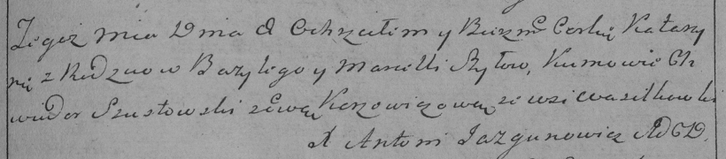

**Шило Бартоломей Базылев (Szyło Bartołomiey)**

25 августа 1801 г -- крещение (НИАБ 937-4-32, лист 4об, №17/1801-р).

**НИАБ 937-4-32:** Лист 4об. **Метрическая запись №17/1801-р.**

{width="6.496527777777778in"
height="0.7409722222222223in"}

Дедиловичский костел Наисвятейшего Сердца Иисуса. 25 августа 1801 года.
Метрическая запись о крещении.

Szyło Bartołomei -- сын крестьян с деревни Васильковка.

Szyło Baseli -- отец.

Szyłowa Marcella -- мать.

Szustowski Joannis -- крестный отец.

Szyłowa Zienowia -- крестная мать.

Linhart Hyacinthus -- ксёндз.
