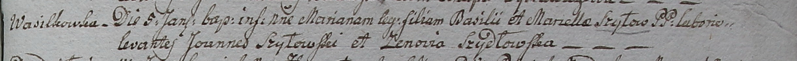

**Шило Марьяна Базылева (Szyłowna Mariana)**

5 января 1799 г -- крещение (НИАБ 136-13-1781-27-199, лист 125,
№3/1799-р).

**НИАБ 1781-27-199:** Лист 125. **Метрическая запись №3/1799-р.**

Дедиловичский костел Наисвятейшего Сердца Иисуса. 5 января 1799 года.
Метрическая запись о крещении.

Szyłowna Mariana -- дочь крестьян с деревни Васильковка.

Szyło Basili -- отец.

Szyłowa Marcełła -- мать.

Szyłowski Joann -- крестный отец.

Szydłowska Zenowia - крестная мать.

Linhart Hyacinthus -- ксёндз.
