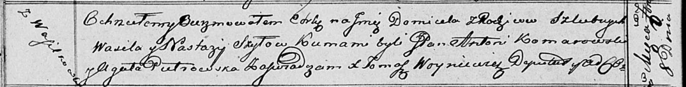

**Шило Домицеля Василева (Szyłowna Domicela)**

8 сентября 1816 г -- крещение (НИАБ 136-13-894, лист 94об, №30/1816-р
(ориг)).

**НИАБ 136-13-894:** Лист 94об. **Метрическая запись №30/1816-р
(ориг).**

Осовская Покровская церковь. 8 сентября 1816 года. Метрическая запись о
крещении.

Szyłowna Domicela -- дочь родителей с деревни Васильковка.

Szyło Wasil -- отец.

Szyłowna Nastazija -- мать.

Komarowski Antoni, JP -- кум.

Pietrowska Agata -- кума.

Woyniewicz Tomasz -- ксёндз.
