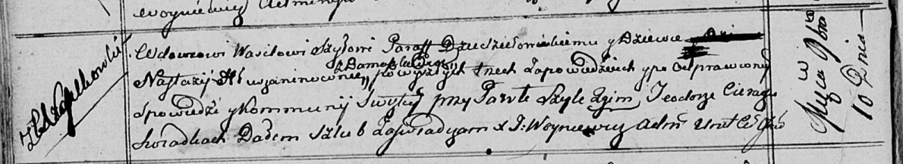
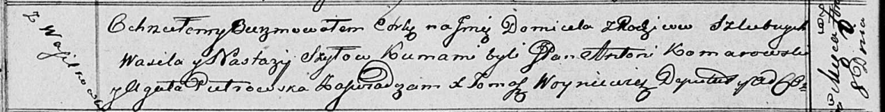
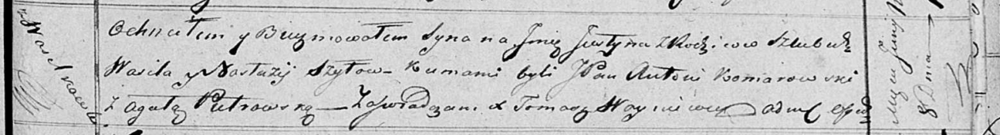

**Шило (в девичестве Глушень) Настасья (Szyłowa Nastazija z
Hłuszanonow)**

10 ноября 1812 г -- венчание с вдовцом Василём Шило с деревни
Васильковка (НИАБ 136-13-920, лист 18об, №4/1812-б (ориг)).

8 сентября 1816 г -- крещение дочери Домицели (НИАБ 136-13-894, лист
94об, №30/1816-р (ориг)).

8 июня 1819 г -- крещение сына Юстына (НИАБ 136-13-894, лист 101,
№29/1819-р (ориг)).

**НИАБ 136-13-920:** Лист 18об. **Метрическая запись №4/1812-б (ориг).**

Осовская Покровская церковь. 10 ноября 1812 года. Запись о венчании.

Szyło Wasil -- жених, вдовец, парафии Дедиловичской католической, с
деревни Васильковка.

Hłuszanonowna Nastazija -- невеста, девка, с деревни Домашковичи.

Szyło Paweł -- свидетель.

Cierach Teodor -- свидетель.

Woyniewicz Tomasz -- ксёндз.

**НИАБ 136-13-894:** Лист 94об. **Метрическая запись №30/1816-р
(ориг).**

Осовская Покровская церковь. 8 сентября 1816 года. Метрическая запись о
крещении.

Szyłowna Domicela -- дочь родителей с деревни Васильковка.

Szyło Wasil -- отец.

Szyłowna Nastazija -- мать.

Komarowski Antoni, JP -- кум.

Pietrowska Agata -- кума.

Woyniewicz Tomasz -- ксёндз.

**НИАБ 136-13-894:** Лист 101. **Метрическая запись №29/1819-р (ориг).**

Осовская Покровская церковь. 8 июня 1819 года. Метрическая запись о
крещении.

Szyło Justyn -- сын родителей с деревни Васильковка.

Szyło Wasil -- отец.

Szyłowa Nastazija -- мать.

Komarowski Antoni, JP -- кум, шляхтич.

Pietrowska Agata -- кума.

Woyniewicz Tomasz -- ксёндз.
