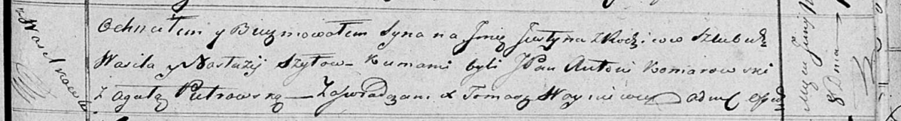

**Шило Юстын Василев (Szyło Justyn)**

8 июня 1819 г -- крещение сына Юстына (НИАБ 136-13-894, лист 101,
№29/1819-р (ориг)).

**НИАБ 136-13-894:** Лист 101. **Метрическая запись №29/1819-р (ориг).**

{width="6.496527777777778in"
height="0.8790332458442695in"}

Осовская Покровская церковь. 8 июня 1819 года. Метрическая запись о
крещении.

Szyło Justyn -- сын родителей с деревни Васильковка.

Szyło Wasil -- отец.

Szyłowa Nastazija -- мать.

Komarowski Antoni, JP -- кум, шляхтич.

Pietrowska Agata -- кума.

Woyniewicz Tomasz -- ксёндз.
