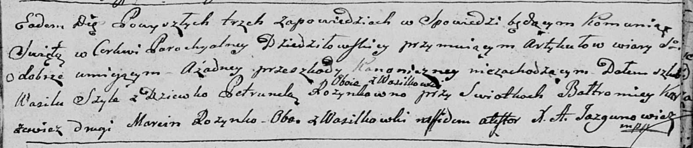

**Шило Василь (Szyło Wasil)**

29 января 1797 г -- венчание с девкой Петрунелей Розынко с деревни
Васильковка (НИАБ 136-13-920, лист 4, №4/1797-б (ориг)).

**НИАБ 136-13-920:** Лист 4. **Метрическая запись №4/1797-б (ориг).**

{width="6.496527777777778in"
height="1.3933103674540683in"}

Дедиловичская Покровская церковь. 29 января 1797 года. Метрическая
запись о венчании.

Szyło Wasil -- жених, с деревни Васильковка.

Rozynkowa Petrunela -- невеста, девка, с деревни Васильковка.

Karżewicz Bałtromiey -- свидетель, с деревни Васильковка.

Rozynko Marcin -- свидетель, с деревни Васильковка.

Jazgunowicz Antoni -- ксёндз.
