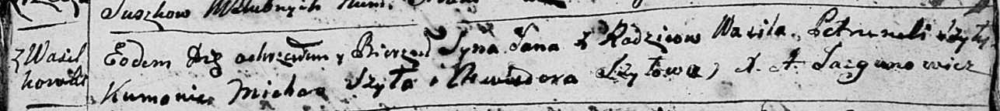
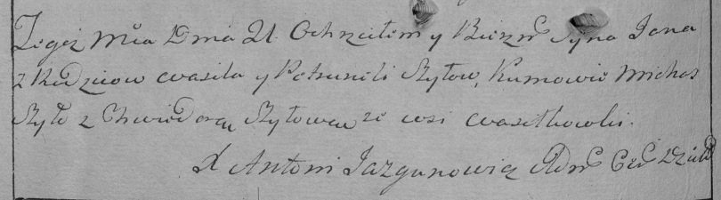
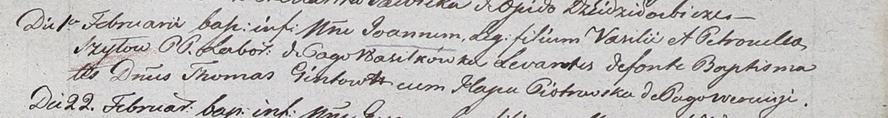
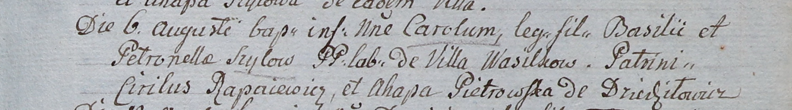
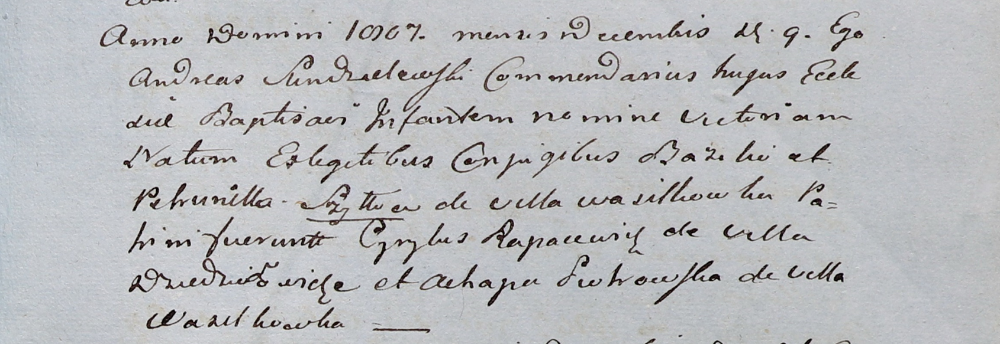

**Шило Василь (Szyło Wasil, Basili)**

21 апреля 1796 г -- крещение сына Яна (НИАБ 136-13-894, лист 29,
№49/1796-р (ориг)), (РГИА 823-2-18, лист 255об, №23/1796-р (коп)).

1 февраля 1803 г -- крещение сына Иоанна (НИАБ 937-4-32, лист 9,
№2/1803-р).

6 августа 1805 г -- крещение сына Кароля (НИАБ 937-4-32, лист 12,
№29/1805-р).

9 декабря 1807 г -- крещение дочери Виктории (НИАБ 937-4-32, лист 17,
№24/1807-р).

**НИАБ 136-13-894:** Лист 29. **Метрическая запись №49/1796-р (ориг).**

Дедиловичская Покровская церковь. 21 апреля 1796 года. Метрическая
запись о крещении.

Szyło Jan -- сын родителей с деревни Васильковка.

Szyło Wasil -- отец.

Szyłowa Petrunela -- мать.

Szyło Michaś - кум.

Szyłowa Chwiedora - кума.

Jazgunowicz Antoni -- ксёндз.

**РГИА 823-2-18:** Лист 255об. **Метрическая запись №23/1796-р (коп).**

Дедиловичская Покровская церковь. 21 апреля 1796 года. Метрическая
запись о крещении.

Szyło Jan -- сын родителей с деревни Васильковка.

Szyło Wasil -- отец.

Szyłowa Petrunela -- мать.

Szyło Michaś -- кум.

Szyłowa Chwiedora -- кума.

Jazgunowicz Antoni -- ксёндз.

**НИАБ 937-4-32:** Лист 9. **Метрическая запись №2/1803-р.**

Дедиловичский костел Наисвятейшего Сердца Иисуса. 1 февраля 1803 года.
Метрическая запись о крещении.

Szyło Joann -- сын крестьян с деревни Васильковка.

Szyło Vasil -- отец.

Szyłowa Petronella -- мать.

Gintowt Thomas -- крестный отец, шляхтич.

Piotrowska Hapa -- крестная мать, с деревни Веретей.

Linhart Hyacinthus -- ксёндз.

**НИАБ 937-4-32:** Лист 12. **Метрическая запись №29/1805-р.**

Дедиловичский костел Наисвятейшего Сердца Иисуса. 6 августа 1805 года.
Метрическая запись о крещении.

Szyłowna Carol -- сын крестьян с деревни Васильковка.

Szyło Basili -- отец.

Szyłowa Petronella -- мать.

Rapacewicz Cirilus -- крестный отец.

Pietrowska Ahapa -- крестная мать, с деревни Дедиловичи.

Linhart Hiacinthus -- ксёндз.

**НИАБ 937-4-32:** Лист 17. **Метрическая запись №24/1807-р.**

Дедиловичский костел Наисвятейшего Сердца Иисуса. 9 декабря 1807 года.
Метрическая запись о крещении.

Szyłłowna Victoria -- дочь родителей с деревни Васильковка.

Szyłło Bazili -- отец.

Szyłłowa Petrunella -- мать.

Rapacewicz Cyrylus -- крестный отец, с деревни Дедиловичи.

Piоtrowska Ahapa -- крестная мать, с деревни Васильковка.

Scindzelewski Andreas -- ксёндз, викарий Дедиловичский.
