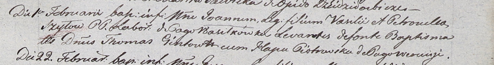

**Шило Иоанн Василев (Szyło Joann)**

1 февраля 1803 г -- крещение (НИАБ 937-4-32, лист 9, №2/1803-р).

**НИАБ 937-4-32:** Лист 9. **Метрическая запись №2/1803-р.**

Дедиловичский костел Наисвятейшего Сердца Иисуса. 1 февраля 1803 года.
Метрическая запись о крещении.

Szyło Joann -- сын крестьян с деревни Васильковка.

Szyło Vasil -- отец.

Szyłowa Petronella -- мать.

Gintowt Thomas -- крестный отец, шляхтич.

Piotrowska Hapa -- крестная мать, с деревни Веретей.

Linhart Hyacinthus -- ксёндз.
