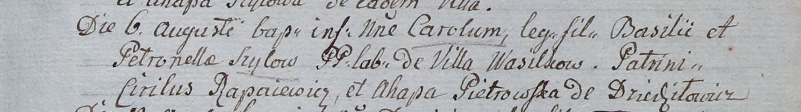

**Шило Кароль Василев (Szyło Carol)**

6 августа 1805 г -- крещение (НИАБ 937-4-32, лист 12, №29/1805-р).

**НИАБ 937-4-32:** Лист 12. **Метрическая запись №29/1805-р.**

{width="6.496527777777778in"
height="0.9097222222222222in"}

Дедиловичский костел Наисвятейшего Сердца Иисуса. 6 августа 1805 года.
Метрическая запись о крещении.

Szyłowna Carol -- сын крестьян с деревни Васильковка.

Szyło Basili -- отец.

Szyłowa Petronella -- мать.

Rapacewicz Cirilus -- крестный отец.

Pietrowska Ahapa -- крестная мать, с деревни Дедиловичи.

Linhart Hiacinthus -- ксёндз.
