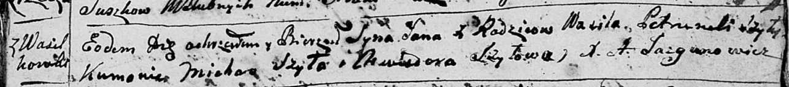
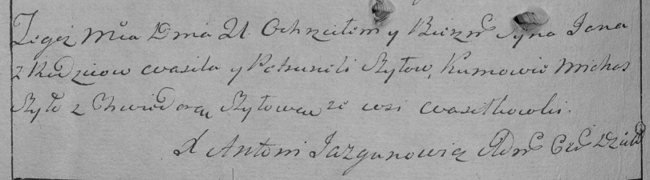

**Шило Ян Василев (Szyło Jan)**

21 апреля 1796 г -- крещение (НИАБ 136-13-894, лист 29, №49/1796-р
(ориг)), (РГИА 823-2-18, лист 255об, №23/1796-р (коп)).

**НИАБ 136-13-894:** Лист 29. **Метрическая запись №49/1796-р (ориг).**

Дедиловичская Покровская церковь. 21 апреля 1796 года. Метрическая
запись о крещении.

Szyło Jan -- сын родителей с деревни Васильковка.

Szyło Wasil -- отец.

Szyłowa Petrunela -- мать.

Szyło Michaś - кум.

Szyłowa Chwiedora - кума.

Jazgunowicz Antoni -- ксёндз.

**РГИА 823-2-18:** Лист 255об. **Метрическая запись №23/1796-р (коп).**

Дедиловичская Покровская церковь. 21 апреля 1796 года. Метрическая
запись о крещении.

Szyło Jan -- сын родителей с деревни Васильковка.

Szyło Wasil -- отец.

Szyłowa Petrunela -- мать.

Szyło Michaś -- кум.

Szyłowa Chwiedora -- кума.

Jazgunowicz Antoni -- ксёндз.
