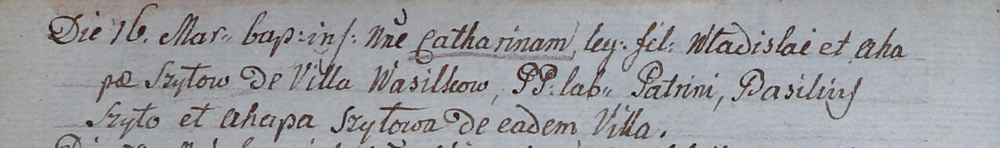

**Шило Владислав (Szyło Władisław)**

16 марта 1805 г -- крещение дочери Катарины (НИАБ 937-4-32, лист 11об,
№11/1805-р).

**НИАБ 937-4-32:** Лист 11об. **Метрическая запись №11/1805-р.**

{width="6.496527777777778in"
height="0.9680555555555556in"}

Дедиловичский костел Наисвятейшего Сердца Иисуса. 16 марта 1805 года.
Метрическая запись о крещении.

Szyłowna Catharina -- дочь крестьян с деревни Васильковка.

Szyło Władisław -- отец.

Szyłowa Ahapa -- мать.

Szyło Basili -- крестный отец.

Szyłowa Ahapa -- крестная мать, с деревни Васильковка.

Linhart Hiacinthus -- ксёндз.
