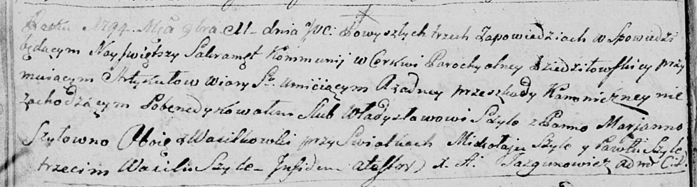

**Шило Владыслав (Szyło Władysław)**

11 ноября 1794 г -- венчание с Марьяной Шило с деревни Васильковка (НИАБ
136-13-920, лист 1об, №12/1794-б (ориг)).

**НИАБ 136-13-920:** Лист 1об. **Метрическая запись №12/1794-б (ориг).**

Дедиловичская Покровская церковь. 11 ноября 1794 года. Метрическая
запись о венчании.

Szyło Władysław -- жених, деревня Васильковка.

Szyłowna Marjanna -- невеста, деревня Васильковка.

Szyło Mikołay -- свидетель.

Szyło Pawluk -- свидетель.

Szyło Wasil -- свидетель.

Jazgunowicz Antoni -- ксёндз.
