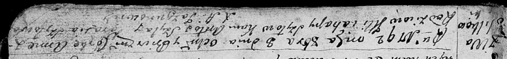

**Шило Анна Ильина (Szyłowna Anna)**

8 октября 1792 г -- крещение (НИАБ 136-13-894, лист 17, №69/1792-р
(ориг)).

**НИАБ 136-13-894:** Лист 17. **Метрическая запись №69/1792-р (ориг).**

{width="6.496527777777778in"
height="0.771081583552056in"}

Дедиловичская Покровская церковь. 8 октября 1792 года. Метрическая
запись о крещении.

Szyłowna Anna -- дочь родителей с деревни Васильковка.

Szyło Jlla -- отец.

Szyłowa Ahapa -- мать.

Szyło Antoś - кум.

Szyłowa Parasia - кума.

Jazgunowicz Antoni -- ксёндз.
