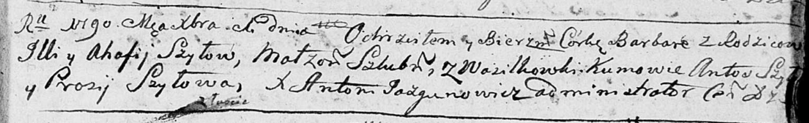
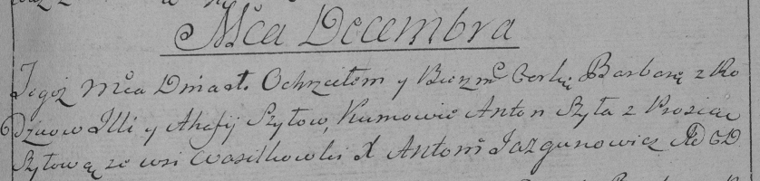

**Шило Варвара Ильина (Szyłowna Barbara)**

1 декабря 1790 г -- крещение (НИАБ 136-13-894, лист 12, №87/1790-р
(ориг)), (РГИА 823-2-18, лист 241, №33/1790-р (коп)).

**НИАБ 136-13-894:** Лист 12. **Метрическая запись №87/1790-р (ориг).**

Дедиловичская Покровская церковь. 1 декабря 1790 года. Метрическая
запись о крещении.

Szyłowna Barbara -- дочь родителей с деревни Васильковка.

Szyło Jlla -- отец.

Szyłowa Ahafia -- мать.

Szyło Antoś - кум.

Szyłowa Prosia - кума.

Jazgunowicz Antoni -- ксёндз.

**РГИА 823-2-18:** Лист 241. **Метрическая запись №33/1790-р (коп).**

Дедиловичская Покровская церковь. 1 декабря 1790 года. Метрическая
запись о крещении.

Szyłowna Barbara -- дочь родителей с деревни Васильковка.

Szyło Jlla -- отец.

Szyłowa Ahafija -- мать.

Szyła Anton -- кум.

Szyłowa Prosia - кума.

Jazgunowicz Antoni -- ксёндз.
