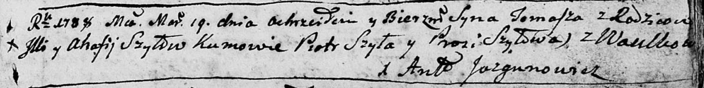

**Шило Фома Ильин (Szyło Tomasz)**

19 марта 1788 г -- крещение (НИАБ 136-13-894, лист 4, №25/1788-р
(ориг)), (РГИА 823-2-18, лист 236, №8/1788-р (коп)).

**НИАБ 136-13-894:** Лист 4. **Метрическая запись №25/1788-р (ориг).**

Дедиловичская Покровская церковь. 19 марта 1788 года. Метрическая запись
о крещении.

Szyło Tomasz -- сын родителей с деревни Васильковка.

Szyło Jlla -- отец.

Szyłowa Ahafia -- мать.

Szyło Piotr - кум.

Szyłowa Prosia - кума.

Jazgunowicz Antoniusz -- ксёндз.

**РГИА 823-2-18:** Лист 236. **Метрическая запись №9/1788-р (коп).**

Дедиловичская Покровская церковь. 19 марта 1788 года. Метрическая запись
о крещении.

Szyło Tomasz -- сын родителей с деревни Васильковка.

Szyło Jlla -- отец.

Szyłowa Ahafija -- мать.

Szyło Piotr -- кум.

Szyłowa Prosia - кума.

Jazgunowicz Antoni -- ксёндз.
