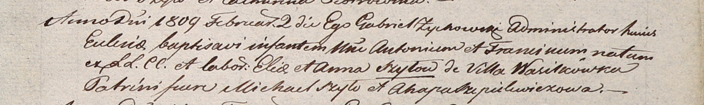

**Шило Антон Ильин (Szyło Antoni Francisc)**

2 февраля 1809 г -- крещение (НИАБ 937-4-32, лист 19, №4/1809-р).

**НИАБ 937-4-32:** Лист 19. **Метрическая запись №4/1809-р.**

{width="6.496527777777778in"
height="0.9770833333333333in"}

Дедиловичский костел Наисвятейшего Сердца Иисуса. 2 февраля 1809 года.
Метрическая запись о крещении.

Szyło Antoni Francisc -- сын крестьян с деревни Васильковка.

Szyło Elia -- отец.

Szyłowa Anna -- мать.

Szyło Michael -- крестный отец.

Szepelewiczowa Ahapa -- крестная мать.

Zychowski Gabriel -- ксёндз.
