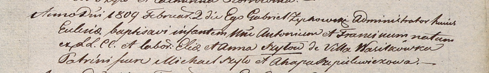

**Шило Илья (Szyło Elia)**

7 октября 1800 г -- крещение сына Франциска (НИАБ 937-4-32, лист 3,
№32/1800-р).

10 мая 1804 г -- крещение сына Николая (НИАБ 937-4-32, лист 10,
№11/1804-р).

25 июля 1805 г -- крещение дочери Магдалены (НИАБ 937-4-32, лист 12,
№28/1805-р).

2 февраля 1809 г -- крещение сына Антона Франциска (НИАБ 937-4-32, лист
19, №4/1809-р).

8 апреля 1811 г -- крещение дочери Елены (НИАБ 937-4-32, лист 23,
№5/1811-р).

**НИАБ 937-4-32:** Лист 3. **Метрическая запись №32/1800-р.**

Дедиловичский костел Наисвятейшего Сердца Иисуса. 7 октября 1800 года.
Метрическая запись о крещении.

Szyło Francisk -- сын крестьян с деревни Васильковка.

Szyło Elia -- отец.

Szyłowa Anna -- мать.

Szyło Michael -- крестный отец, с деревни Васильковка.

Galiszewska Anna -- крестная мать, с деревни Васильковка.

Linhart Hyacinthus -- ксёндз.

**НИАБ 937-4-32:** Лист 10. **Метрическая запись №11/1804-р.**

Дедиловичский костел Наисвятейшего Сердца Иисуса. 10 мая 1804 года.
Метрическая запись о крещении.

Szyło Nicołai -- сын родителей с деревни Васильковка.

Szyło Elia -- отец.

Szyłowa Anna -- мать.

Korw? German -- крестный отец, с деревни Омнишево.

Szepelewiczowa Agatha -- крестная мать.

Galinowski Joann -- ксёндз, комендант Дедиловичского костела.

**НИАБ 937-4-32:** Лист 12. **Метрическая запись №28/1805-р.**

Дедиловичский костел Наисвятейшего Сердца Иисуса. 25 июля 1805 года.
Метрическая запись о крещении.

Szyłowna Magdalena -- дочь крестьян с деревни Васильковка.

Szyło Elia -- отец.

Szyłowa Anna -- мать.

Szyło Michał -- крестный отец.

Szyłowa Ahapa -- крестная мать, с деревни Васильковка.

Linhart Hiacinthus -- ксёндз.

**НИАБ 937-4-32:** Лист 19. **Метрическая запись №4/1809-р.**

Дедиловичский костел Наисвятейшего Сердца Иисуса. 2 февраля 1809 года.
Метрическая запись о крещении.

Szyło Antoni Francisc -- сын крестьян с деревни Васильковка.

Szyło Elia -- отец.

Szyłowa Anna -- мать.

Szyło Michael -- крестный отец.

Szepelewiczowa Ahapa -- крестная мать.

Zychowski Gabriel -- ксёндз.

**НИАБ 937-4-32:** Лист 23. **Метрическая запись №5/1811-р.**

Дедиловичский костел Наисвятейшего Сердца Иисуса. 8 апреля 1811 года.
Метрическая запись о крещении.

Szyłowna Helena -- дочь крестьян с деревни Васильковка.

Szyło Eliis -- отец.

Szyłowa Anna -- мать.

Szyło Michael -- крестный отец.

Szyłowa Eudoxia -- крестная мать.

Zychowski Gabriel -- ксёндз.
