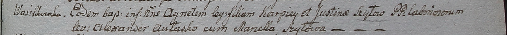

**Шило Агнета Карпова (Szyłowna Agneta)**

27 января 1799 г -- крещение (НИАБ 1781-27-199, лист 125, №11/1799-р).

**НИАБ 1781-27-199:** Лист 125. **Метрическая запись №11/1799-р.**

Дедиловичский костел Наисвятейшего Сердца Иисуса. 27 января 1799 года.
Метрическая запись о крещении.

Szyłowna Agneta -- дочь крестьян с деревни Васильковка.

Szyło Karpiey -- отец.

Szyłowa Justina -- мать.

Aułasko Alexander -- крестный отец.

Szyłowa Marcella - крестная мать.

Linhart Hyacinthus -- ксёндз.
