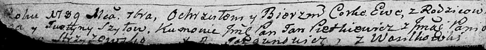

**Шило Ева Карпова (Szyłowna Ewa)**

30 сентября 1789 г -- крещение (НИАБ 136-13-894, лист 7об, №50/1789-р
(ориг)), (РГИА 823-2-18, лист 238об, №23/1789-р (коп)).

Лист 7об. **Метрическая запись №50/1789-р (ориг).**

Дедиловичская Покровская церковь. 30 сентября 1789 года. Метрическая
запись о крещении.

Szyłowna Ewa -- дочь родителей с деревни Васильковка.

Szyło \[Karp\] -- отец.

Szyłowa Justyna -- мать.

Pietkiewicz Jan, JP -- кум, шляхтич.

Strzyzowska \[Elena\], JP -- кума, шляхтянка.

Jazgunowicz Antoni -- ксёндз.

**РГИА 823-2-18:** Лист 238об. **Метрическая запись №23/1789-р (коп).**

Дедиловичская Покровская церковь. 30 сентября 1789 года. Метрическая
запись о крещении.

Szyłowna Ewa -- дочь родителей с деревни Васильковка.

Szyło Karp -- отец.

Szyłowa Justyna -- мать.

Pietkiewicz Jan -- кум.

Stryżewska Elena - кума.

Jazgunowicz Antoni -- ксёндз.
